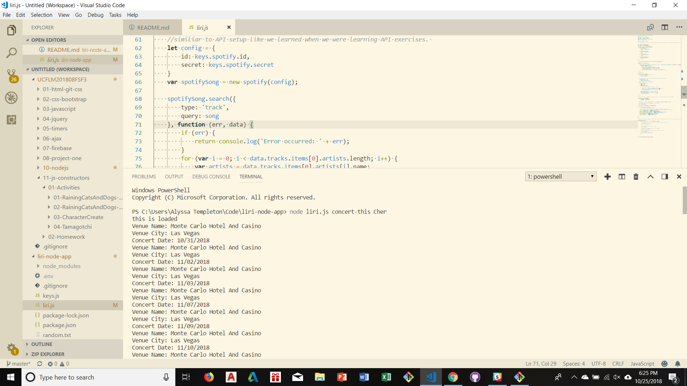
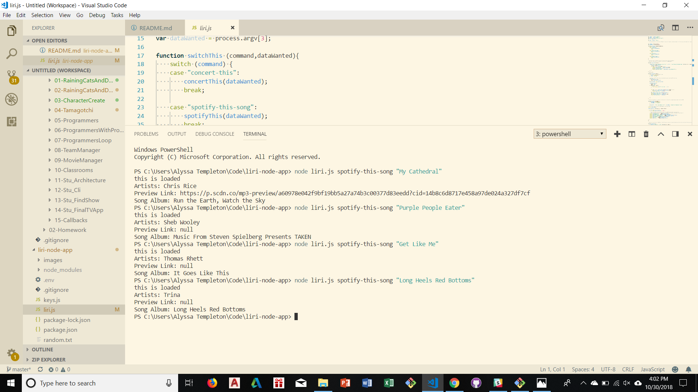
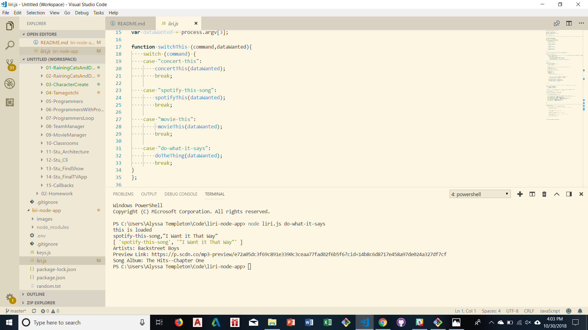

Liri Bot is a program that runs in node to give you information on music and movies. Liri has four programs you can run. 
This first function is "concert-this". See the screenshot below:

"concert-this" requires you to enter node, the file name (liri.js), the command "concert-this", and an artist whose shows you would like to see. Once run, it will show you upcoming concerts of that artist in your area. 

The second function is "movie-this". "movie-this" requires you to input node, the file name (liri.js), the command "movie-this", and the title of a movie you would like more info on. See the screenshot below for examples. 

The third function is for music, and is called "spotify-this-song". This function requires node, liri.js, the command "spotify-this-song", and the title of a song you want to know more about. See the screenshot below for examples. 

The last function is "do-what-it-says". This function takes two commands written in a text file and executes them in node. Whatever two partner commands from the previous three functions are put in the text file will be executed. See the screenshot below for an example. 

